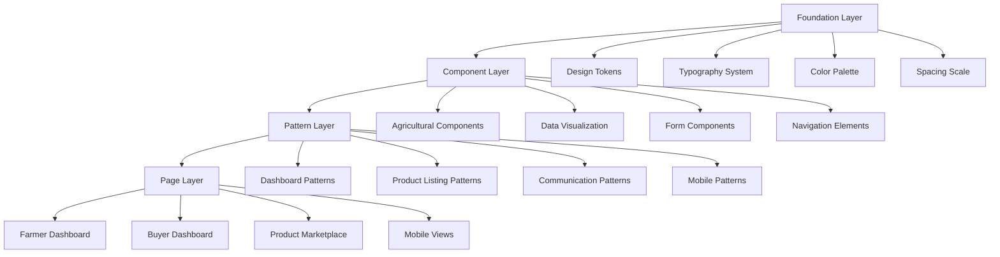

# Design Document: UmuhinziLink Design Audit and Modernization

## Overview

This design document outlines a comprehensive modernization strategy for UmuhinziLink, an agricultural platform connecting farmers, buyers, and agricultural resources in Rwanda. The design focuses on creating a premium yet approachable agricultural-themed design system that enhances user experience while respecting the cultural context and practical needs of the farming community.

The modernization addresses current design inconsistencies, establishes a cohesive design system, and optimizes the platform for rural mobile usage while maintaining professional standards suitable for digital agriculture.

## Architecture

### Design System Architecture

The design system follows a token-based architecture with four primary layers:

1. **Foundation Layer**: Core design tokens (colors, typography, spacing, shadows)
2. **Component Layer**: Reusable UI components optimized for agricultural workflows
3. **Pattern Layer**: Common interface patterns and layouts
4. **Page Layer**: Complete page templates and user flows



### Information Architecture

The platform's information architecture prioritizes agricultural workflows:

- **Primary Navigation**: Role-based dashboards (Farmer, Buyer, Supplier, Admin)
- **Secondary Navigation**: Feature-specific sections within each role
- **Content Hierarchy**: Agricultural data takes precedence with clear visual hierarchy
- **Mobile-First Structure**: Simplified navigation for field usage

## Components and Interfaces

### Enhanced Design Token System

#### Agricultural Color Palette

**Primary Agricultural Greens**
- `--agricultural-primary`: #2D5016 (Deep Forest Green)
- `--agricultural-primary-light`: #4A7C59 (Sage Green)
- `--agricultural-primary-lighter`: #7FB069 (Fresh Leaf Green)
- `--agricultural-primary-lightest`: #B8E6B8 (Mint Green)

**Earth Tone Complementary Colors**
- `--earth-brown`: #8B4513 (Saddle Brown)
- `--earth-brown-light`: #CD853F (Peru Brown)
- `--earth-ochre`: #CC7722 (Ochre)
- `--earth-clay`: #B87333 (Clay Brown)

**Fresh Accent Colors**
- `--harvest-gold`: #FFD700 (Golden Yellow)
- `--sunrise-orange`: #FF8C42 (Warm Orange)
- `--sky-blue`: #87CEEB (Light Sky Blue)
- `--soil-rich`: #654321 (Dark Brown)

**Semantic Agricultural Colors**
- `--growth-success`: #32CD32 (Lime Green)
- `--caution-yellow`: #FFD700 (Gold)
- `--alert-red`: #DC143C (Crimson)
- `--info-blue`: #4682B4 (Steel Blue)

#### Enhanced Typography System

**Font Stack Optimization**
```css
--font-primary: 'Poppins', 'Segoe UI', 'Roboto', 'Helvetica Neue', sans-serif;
--font-display: 'Poppins', 'Georgia', serif;
--font-mono: 'JetBrains Mono', 'Consolas', monospace;
```

**Agricultural Typography Scale**
- `--text-display`: clamp(2.5rem, 5vw, 4rem) - Hero headings
- `--text-h1`: clamp(2rem, 4vw, 3rem) - Page titles
- `--text-h2`: clamp(1.5rem, 3vw, 2.25rem) - Section headings
- `--text-h3`: clamp(1.25rem, 2.5vw, 1.875rem) - Subsection headings
- `--text-body`: 1rem - Default body text
- `--text-caption`: 0.875rem - Secondary information
- `--text-label`: 0.75rem - Form labels and metadata

#### Organic Spacing System

**4px Base Grid System**
- `--space-xs`: 4px
- `--space-sm`: 8px
- `--space-md`: 16px
- `--space-lg`: 24px
- `--space-xl`: 32px
- `--space-2xl`: 48px
- `--space-3xl`: 64px

**Agricultural-Specific Spacing**
- `--card-padding`: 20px (Comfortable for touch)
- `--section-gap`: 40px (Clear content separation)
- `--mobile-margin`: 16px (Optimal for mobile usage)

### Agricultural-Specific Components

#### Farm Product Card Component

```typescript
interface FarmProductCardProps {
  product: {
    id: string;
    name: string;
    category: string;
    price: number;
    unit: string;
    quantity: number;
    harvestDate: string;
    location: string;
    farmer: {
      name: string;
      verified: boolean;
      rating: number;
    };
    image?: string;
    freshness: 'fresh' | 'good' | 'fair';
    organic: boolean;
  };
  variant: 'grid' | 'list' | 'featured';
  onContact: (farmerId: string) => void;
  onSave: (productId: string) => void;
}
```

**Design Features:**
- Organic rounded corners (12px border-radius)
- Natural shadow system with green tints
- Freshness indicators with color-coded badges
- Farmer verification badges
- Touch-optimized interaction areas (44px minimum)

#### Agricultural Data Visualization Components

**Crop Yield Chart Component**
- Seasonal pattern visualization
- Color-coded growth stages
- Mobile-responsive design
- Accessibility-compliant contrast ratios

**Weather Integration Widget**
- 7-day forecast display
- Agricultural timing recommendations
- Planting/harvesting alerts
- Offline capability indicators

**Price Trend Component**
- Market price fluctuations
- Regional comparison data
- Historical trend analysis
- Export functionality for farmers

### Enhanced Navigation System

#### Mobile-First Sidebar Navigation

**Farmer Navigation Structure:**
```
Dashboard
├── Overview
├── My Products
│   ├── Add New Product
│   ├── Manage Listings
│   └── Product Analytics
├── Orders
│   ├── Pending Orders
│   ├── Order History
│   └── Payment Tracking
├── Market Analysis
├── AI Farming Assistant
├── Messages
└── Profile & Settings
```

**Design Principles:**
- Single-thumb navigation on mobile
- Clear visual hierarchy with agricultural icons
- Contextual badges for notifications
- Offline-first design approach

## Data Models

### Enhanced Product Data Model

```typescript
interface AgriculturalProduct {
  // Core Product Information
  id: string;
  name: string;
  category: ProductCategory;
  subcategory?: string;
  description: string;
  
  // Agricultural Specifics
  variety?: string; // e.g., "Roma Tomatoes"
  harvestDate: Date;
  plantingDate?: Date;
  seasonality: Season[];
  growingMethod: 'organic' | 'conventional' | 'hydroponic';
  
  // Pricing and Availability
  unitPrice: number;
  currency: 'RWF';
  measurementUnit: MeasurementUnit;
  quantity: number;
  minimumOrder?: number;
  negotiable: boolean;
  
  // Quality and Certification
  qualityGrade: 'premium' | 'standard' | 'economy';
  certifications: Certification[];
  freshness: FreshnessLevel;
  shelfLife: number; // days
  
  // Location and Logistics
  farmLocation: Location;
  deliveryOptions: DeliveryOption[];
  pickupAvailable: boolean;
  
  // Farmer Information
  farmer: FarmerProfile;
  
  // Media and Documentation
  images: ProductImage[];
  videos?: ProductVideo[];
  documents?: ProductDocument[];
  
  // Platform Metadata
  status: ProductStatus;
  visibility: 'public' | 'private' | 'draft';
  createdAt: Date;
  updatedAt: Date;
  views: number;
  inquiries: number;
}

enum ProductCategory {
  CEREALS = 'cereals',
  VEGETABLES = 'vegetables',
  FRUITS = 'fruits',
  LEGUMES = 'legumes',
  TUBERS = 'tubers',
  SPICES = 'spices',
  LIVESTOCK = 'livestock',
  DAIRY = 'dairy',
  PROCESSED = 'processed'
}

enum MeasurementUnit {
  KG = 'kg',
  TONS = 'tons',
  BAGS = 'bags',
  PIECES = 'pieces',
  LITERS = 'liters',
  BUNCHES = 'bunches'
}

enum FreshnessLevel {
  JUST_HARVESTED = 'just_harvested',
  FRESH = 'fresh',
  GOOD = 'good',
  FAIR = 'fair'
}
```

### Enhanced User Profile Models

```typescript
interface FarmerProfile extends BaseUserProfile {
  // Farm Information
  farmName?: string;
  farmSize: number; // in hectares
  farmingExperience: number; // years
  primaryCrops: ProductCategory[];
  farmingMethods: ('organic' | 'conventional' | 'mixed')[];
  
  // Location and Infrastructure
  farmLocation: DetailedLocation;
  irrigationAccess: boolean;
  storageCapacity: number; // in tons
  transportationAccess: TransportationOption[];
  
  // Certifications and Verification
  verificationStatus: 'verified' | 'pending' | 'unverified';
  certifications: FarmCertification[];
  governmentId: string;
  
  // Performance Metrics
  rating: number;
  totalSales: number;
  completedOrders: number;
  responseTime: number; // average hours
  
  // Financial Information
  bankingDetails?: BankingInfo;
  mobileMoneyAccounts: MobileMoneyAccount[];
  
  // Communication Preferences
  preferredLanguage: 'kinyarwanda' | 'english' | 'french';
  communicationChannels: CommunicationChannel[];
  availabilityHours: AvailabilitySchedule;
}

interface BuyerProfile extends BaseUserProfile {
  // Business Information
  businessName?: string;
  businessType: 'restaurant' | 'retailer' | 'processor' | 'exporter' | 'individual';
  businessSize: 'small' | 'medium' | 'large';
  
  // Purchasing Preferences
  preferredCategories: ProductCategory[];
  averageOrderValue: number;
  orderFrequency: 'daily' | 'weekly' | 'monthly' | 'seasonal';
  qualityRequirements: QualityStandard[];
  
  // Location and Logistics
  deliveryAddresses: DeliveryAddress[];
  preferredDeliveryMethods: DeliveryMethod[];
  
  // Performance Metrics
  rating: number;
  totalPurchases: number;
  paymentReliability: number;
  
  // Financial Information
  creditLimit?: number;
  paymentMethods: PaymentMethod[];
  
  // Communication Preferences
  preferredLanguage: 'kinyarwanda' | 'english' | 'french';
  notificationPreferences: NotificationPreference[];
}
```

## Correctness Properties

*A property is a characteristic or behavior that should hold true across all valid executions of a system—essentially, a formal statement about what the system should do. Properties serve as the bridge between human-readable specifications and machine-verifiable correctness guarantees.*

### Design System Properties

Based on the prework analysis, the following properties validate the design system implementation:

**Property 1: Agricultural Color Palette Compliance**
*For any* primary color defined in the design system, it should fall within the earth-tone green HSL ranges (Hue: 60-180°, Saturation: 20-80%, Lightness: 20-80%) to represent agricultural growth and sustainability
**Validates: Requirements 2.1**

**Property 2: Color Harmony Validation**
*For any* secondary color in the design system, it should have complementary or analogous relationships with primary colors using color theory algorithms (complementary: 180° hue difference, analogous: 30° hue difference)
**Validates: Requirements 2.2**

**Property 3: Accent Color Vibrancy**
*For any* accent color, it should meet vibrancy criteria with saturation ≥ 70% and lightness between 40-80% to ensure fresh, vibrant appearance
**Validates: Requirements 2.3**

**Property 4: Semantic Color Harmony**
*For any* semantic color (success/error/warning), it should maintain color harmony with the agricultural palette by having hue differences ≤ 60° from primary colors
**Validates: Requirements 2.4**

**Property 5: Color Scale Completeness**
*For any* primary color, the design system should provide exactly 9 shade variations (50, 100, 200, 300, 400, 500, 600, 700, 800, 900) with consistent lightness progression
**Validates: Requirements 2.5**

**Property 6: WCAG Contrast Compliance**
*For any* color combination used in the design system, the contrast ratio should meet WCAG 2.1 AA requirements (≥ 4.5:1 for normal text, ≥ 3:1 for large text)
**Validates: Requirements 2.6**

**Property 7: Font Loading Performance**
*For any* font implementation, it should load without causing Cumulative Layout Shift (CLS) > 0.1 and include proper fallback fonts
**Validates: Requirements 3.1**

**Property 8: Typography Hierarchy Distinction**
*For any* adjacent heading levels, the font size difference should be ≥ 1.2x (major second scale) to ensure clear visual distinction
**Validates: Requirements 3.2**

**Property 9: Body Text Readability**
*For any* body text style, it should maintain line-height between 1.4-1.6, character spacing ≥ 0.12em, and minimum font size of 16px for optimal readability
**Validates: Requirements 3.3**

**Property 10: Responsive Typography Scaling**
*For any* typography element, it should scale smoothly between mobile (320px) and desktop (1920px) viewports while maintaining readability thresholds
**Validates: Requirements 3.4**

**Property 11: High Contrast Readability**
*For any* text element, the contrast ratio should exceed 7:1 to ensure readability in bright outdoor conditions
**Validates: Requirements 3.5**

**Property 12: Specialized Text Style Completeness**
*For any* agricultural data type (prices, quantities, measurements), there should be a corresponding specialized text style with appropriate formatting
**Validates: Requirements 3.6**

**Property 13: Form Accessibility Compliance**
*For any* form component, it should include proper ARIA labels, keyboard navigation support, and error state indicators
**Validates: Requirements 4.3**

**Property 14: Navigation Consistency**
*For any* navigation component (sidebar, header), it should follow consistent structural patterns, styling, and interaction behaviors
**Validates: Requirements 4.5**

**Property 15: Interactive State Completeness**
*For any* interactive element, it should define hover, focus, and active states with appropriate timing (≤ 200ms transitions) and visual feedback
**Validates: Requirements 4.6**

**Property 16: Product Card Information Completeness**
*For any* farm product card, it should display all required fields (name, price, quantity, farmer info, location) in a structured format
**Validates: Requirements 5.1**

**Property 17: Farmer Profile Component Completeness**
*For any* farmer profile component, it should include all required fields (farm details, experience, location, verification status) and display them properly
**Validates: Requirements 5.2**

**Property 18: Order Management Workflow Support**
*For any* order management component, it should support all required workflow states (pending, confirmed, in-progress, completed, cancelled) with appropriate transitions
**Validates: Requirements 5.3**

**Property 19: Weather Component Information Display**
*For any* weather widget, it should display agricultural timing information (temperature, rainfall, humidity, planting recommendations) with appropriate update intervals
**Validates: Requirements 5.4**

**Property 20: Agricultural Unit Support**
*For any* measurement component, it should support all specified agricultural units (kg, tons, hectares, bags, pieces, liters, bunches) with accurate conversion factors
**Validates: Requirements 5.5**

**Property 21: Communication Feature Completeness**
*For any* communication component, it should support messaging, negotiation features, and maintain proper conversation state
**Validates: Requirements 5.6**

**Property 22: Grid System Consistency**
*For any* layout using the grid system, it should use consistent spacing values from the design token scale and maintain proper alignment
**Validates: Requirements 6.2**

**Property 23: Mobile Touch Optimization**
*For any* mobile interface element, it should have touch targets ≥ 44px and be positioned within thumb-reach zones (bottom 75% of screen)
**Validates: Requirements 6.3**

**Property 24: Content Organization Logic**
*For any* interface section, related agricultural functions should be grouped together and follow consistent organizational patterns
**Validates: Requirements 6.4**

**Property 25: Loading State Implementation**
*For any* component that loads data, it should implement loading states and maintain CLS ≤ 0.1 for rural connectivity optimization
**Validates: Requirements 6.5**

**Property 26: Variable Content Density Support**
*For any* layout, it should maintain usability when content density varies by ±50% to accommodate seasonal workflow changes
**Validates: Requirements 6.6**

**Property 27: Agricultural Gradient Compliance**
*For any* gradient implementation, it should use colors exclusively from the agricultural palette and follow natural color progressions
**Validates: Requirements 7.1**

**Property 28: Texture Readability Preservation**
*For any* texture or pattern, it should maintain opacity ≤ 10% and not reduce text contrast ratios below WCAG requirements
**Validates: Requirements 7.2**

**Property 29: Elevation System Consistency**
*For any* component shadow, it should follow the consistent elevation scale (0, 2, 4, 8, 16, 24px) based on component hierarchy
**Validates: Requirements 7.3**

**Property 30: Animation Performance Standards**
*For any* micro-interaction, it should maintain 60fps performance and use appropriate easing functions (cubic-bezier) for natural feel
**Validates: Requirements 7.4**

**Property 31: Image Style Consistency**
*For any* agricultural product image, it should follow consistent aspect ratios (4:3 or 16:9), compression standards, and filter applications
**Validates: Requirements 7.5**

**Property 32: Premium Accessibility Balance**
*For any* premium visual feature, it should not break basic functionality and maintain accessibility compliance
**Validates: Requirements 7.6**

**Property 33: Touch Target Adequacy**
*For any* interactive element on mobile, it should have minimum dimensions of 44x44px with adequate spacing (8px minimum) between targets
**Validates: Requirements 8.1**

**Property 34: Bandwidth Optimization**
*For any* visual asset, it should be optimized for file size (images ≤ 100KB, total page weight ≤ 1MB) while maintaining visual quality
**Validates: Requirements 8.2**

**Property 35: Outdoor Readability Standards**
*For any* interface element, it should maintain contrast ratios ≥ 7:1 and use colors that remain distinguishable in bright sunlight
**Validates: Requirements 8.3**

**Property 36: Interface Intuitiveness Standards**
*For any* user interface pattern, it should follow standard conventions, use consistent labeling, and require ≤ 3 steps for common tasks
**Validates: Requirements 8.4**

**Property 37: Connectivity Status Feedback**
*For any* feature requiring internet connectivity, it should provide clear, accurate offline/online status indicators with appropriate user feedback
**Validates: Requirements 8.5**

**Property 38: Progressive Loading Implementation**
*For any* content loading, it should implement progressive loading with skeleton screens and work effectively on connections ≥ 2G speeds
**Validates: Requirements 8.6**

**Property 39: Crop Yield Visualization Completeness**
*For any* crop yield chart, it should include seasonal data points, trend lines, and time scales appropriate for agricultural planning
**Validates: Requirements 9.1**

**Property 40: Price Information Comprehensiveness**
*For any* price display interface, it should include historical data, trend indicators, and comparison features to help understand market fluctuations
**Validates: Requirements 9.2**

**Property 41: Weather Integration Completeness**
*For any* weather widget, it should include agricultural-relevant data (temperature, rainfall, humidity, wind) and integrate with planning features
**Validates: Requirements 9.3**

**Property 42: Farm Analytics Insight Provision**
*For any* analytics display, it should provide specific, actionable insights using appropriate visualization methods (charts, graphs, metrics)
**Validates: Requirements 9.4**

**Property 43: Rwandan Geographic Accuracy**
*For any* map-based visualization, it should use accurate Rwandan geographic data and display relevant regional information
**Validates: Requirements 9.5**

**Property 44: Comparative Analysis Support**
*For any* data comparison feature, it should enable side-by-side analysis of different products, farms, or time periods
**Validates: Requirements 9.6**

**Property 45: Keyboard Navigation Support**
*For any* interactive element, it should be keyboard accessible with visible focus indicators and logical tab order
**Validates: Requirements 10.2**

**Property 46: Screen Reader Compatibility**
*For any* component, it should include appropriate ARIA attributes and use semantic HTML elements for screen reader compatibility
**Validates: Requirements 10.3**

**Property 47: Motor Impairment Accommodation**
*For any* interface element, it should provide adequate touch targets (≥ 44px) and alternative input methods where applicable
**Validates: Requirements 10.4**

**Property 48: Multi-language Layout Support**
*For any* layout, it should accommodate text expansion for Kinyarwanda, English, and French (up to 30% expansion) while maintaining usability
**Validates: Requirements 10.5**

**Property 49: Literacy Level Accommodation**
*For any* interface element, it should use consistent iconography with alt text and maintain language complexity appropriate for varying literacy levels
**Validates: Requirements 10.6**

**Property 50: CSS Performance Optimization**
*For any* design token implementation, it should use CSS custom properties efficiently and minimize bundle size impact
**Validates: Requirements 11.1**

**Property 51: Font Loading Optimization**
*For any* font loading, it should prevent layout shifts (CLS ≤ 0.1) and implement proper loading strategies
**Validates: Requirements 11.2**

**Property 52: Animation Performance Consistency**
*For any* animation, it should maintain smooth performance (≥ 60fps) across different device capabilities
**Validates: Requirements 11.3**

**Property 53: Image Performance Optimization**
*For any* image implementation, it should provide responsive solutions with appropriate compression and loading performance
**Validates: Requirements 11.4**

**Property 54: Component Modularity**
*For any* component, it should be optimized for tree-shaking and have minimal runtime overhead when imported
**Validates: Requirements 11.5**

**Property 55: Selective Import Support**
*For any* component library module, it should support individual component imports without including unnecessary dependencies
**Validates: Requirements 11.6**

## Error Handling

### Design System Error Handling Strategy

The design system implements comprehensive error handling across multiple layers:

#### Color System Error Handling
- **Invalid Color Values**: Fallback to nearest valid color in palette
- **Contrast Failures**: Automatic contrast adjustment with user notification
- **Missing Color Tokens**: Graceful degradation to system defaults

#### Typography Error Handling
- **Font Loading Failures**: Immediate fallback to system fonts
- **Responsive Scaling Issues**: Clamp functions prevent extreme scaling
- **Character Encoding Problems**: UTF-8 fallback with proper language support

#### Component Error Handling
- **Missing Props**: Default values with development warnings
- **Data Loading Failures**: Skeleton states with retry mechanisms
- **Responsive Breakpoint Issues**: Mobile-first graceful degradation

#### Performance Error Handling
- **Slow Network Conditions**: Progressive loading with timeout handling
- **Memory Constraints**: Lazy loading and component cleanup
- **Animation Performance Issues**: Automatic fallback to reduced motion

#### Accessibility Error Handling
- **Screen Reader Failures**: Semantic HTML fallbacks
- **Keyboard Navigation Issues**: Focus trap recovery mechanisms
- **Color Blindness Accommodation**: Pattern and texture alternatives

## Testing Strategy

### Dual Testing Approach

The design system requires both unit testing and property-based testing for comprehensive coverage:

#### Unit Testing Focus
- **Specific Examples**: Test concrete design token values and component states
- **Edge Cases**: Boundary conditions for responsive breakpoints and color variations
- **Integration Points**: Component interaction and data flow validation
- **Error Conditions**: Invalid props, network failures, and accessibility edge cases

#### Property-Based Testing Focus
- **Universal Properties**: Validate design system rules across all inputs
- **Comprehensive Coverage**: Test color combinations, typography scales, and component variations
- **Performance Properties**: Validate loading times, animation smoothness, and bundle sizes
- **Accessibility Properties**: Ensure WCAG compliance across all component states

#### Property-Based Testing Configuration

**Testing Library**: Use `fast-check` for TypeScript/JavaScript property-based testing
**Minimum Iterations**: 100 iterations per property test to ensure comprehensive coverage
**Test Tagging**: Each property test must reference its design document property

**Tag Format**: `Feature: umuhinzilink-design-audit, Property {number}: {property_text}`

**Example Property Test Structure**:
```typescript
// Feature: umuhinzilink-design-audit, Property 6: WCAG Contrast Compliance
test('all color combinations meet WCAG 2.1 AA contrast requirements', () => {
  fc.assert(fc.property(
    fc.record({
      foreground: colorArbitrary,
      background: colorArbitrary
    }),
    ({ foreground, background }) => {
      const contrastRatio = calculateContrastRatio(foreground, background);
      const isLargeText = fontSize >= 18 || (fontSize >= 14 && fontWeight >= 700);
      const minimumRatio = isLargeText ? 3 : 4.5;
      
      expect(contrastRatio).toBeGreaterThanOrEqual(minimumRatio);
    }
  ), { numRuns: 100 });
});
```

#### Testing Categories

**Visual Regression Testing**
- Component appearance consistency across browsers
- Responsive behavior validation
- Color accuracy and contrast verification

**Performance Testing**
- Bundle size monitoring
- Loading performance validation
- Animation frame rate testing
- Memory usage optimization

**Accessibility Testing**
- Automated WCAG compliance checking
- Screen reader compatibility validation
- Keyboard navigation testing
- Color blindness simulation

**Cross-Platform Testing**
- Mobile device compatibility
- Rural connectivity simulation
- Offline functionality validation
- Multi-language layout testing

Each correctness property must be implemented by a single property-based test, ensuring direct traceability between design requirements and test validation. The testing strategy balances comprehensive coverage through property-based testing with specific scenario validation through unit tests, providing confidence in the design system's reliability and performance across diverse agricultural use cases.